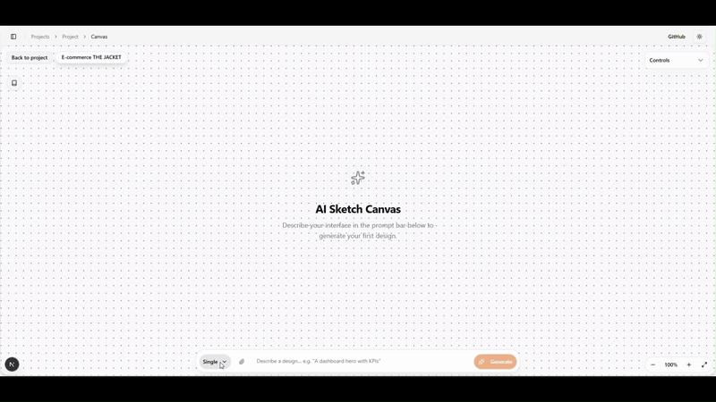

# Chimera

An AI-powered full-stack platform that enables rapid design implementation and intelligent user flow creation. Built with the T3 Stack for Next.js App Router, Chimera bridges the gap between design concepts and production-ready applications through AI assistance.



## ✨ What is Chimera?

Chimera is a modern web application framework that leverages artificial intelligence to streamline the development process. It provides an infinite canvas where designers and developers can:

- **Generate UI designs from text prompts** - Describe what you want, and AI creates the HTML/CSS
- **Create connected user flows** - Build multi-screen prototypes with navigable connections
- **Iterate with AI assistance** - Modify, refine, and extend existing designs using natural language
- **Extract reusable components** - AI identifies and extracts components from your designs
- **Apply design tokens** - Maintain consistent styling across your design system

## 🚀 Features

### AI-Powered Design Canvas
- **AI Design Generation**: Transform text descriptions into functional HTML/CSS components
- **Design Flow Creation**: Generate connected user journeys with AI-powered suggestions
- **Iterative Modifications**: Refine designs using natural language commands
- **Component Extraction**: Identify and extract reusable components from designs
- **Design Token Management**: Extract and apply consistent design tokens across screens

### Multi-Provider LLM Support
- **Google Gemini**: Native integration with Google's AI models
- **OpenRouter**: Access to 100+ models including Claude, GPT-4, Llama, and more
- **Per-Feature Configuration**: Choose different providers/models for each AI feature
- **Dynamic Model Fetching**: Automatically discovers available models from providers

### MCP Server Integration
Chimera exposes an MCP (Model Context Protocol) server, enabling AI coding assistants to interact with your designs:

- **Gemini CLI** / **Claude Code** / **Cursor** / **VS Code** compatible
- Query and manage projects and designs programmatically
- Fetch design connections and user flows
- Perfect for AI-assisted development workflows

### Collaboration & Prototyping
- **Infinite Canvas**: Arrange designs spatially with zoom and pan
- **Prototype Mode**: Navigate through connected designs like a real app
- **Presentation Mode**: Present your designs with live code editing
- **Sketch Integration**: Draw wireframes with Excalidraw and generate designs from sketches

## 🛠️ Tech Stack

| Category | Technology |
|----------|------------|
| **Framework** | [Next.js 15](https://nextjs.org/) (App Router) |
| **Language** | [TypeScript](https://www.typescriptlang.org/) 5.0+ |
| **UI Library** | [React 19](https://react.dev/) |
| **Styling** | [Tailwind CSS v4](https://tailwindcss.com/) & [shadcn/ui](https://ui.shadcn.com/) |
| **State** | [Jotai](https://jotai.org/) (atomic state management) |
| **API** | [tRPC](https://trpc.io/) (end-to-end type-safe) |
| **Database** | [Prisma](https://prisma.io/) with SQLite |
| **Auth** | [Better Auth](https://github.com/better-auth/better-auth) |
| **AI** | [Vercel AI SDK](https://sdk.vercel.ai/docs) (Google & OpenRouter) |
| **Editor** | [Monaco Editor](https://microsoft.github.io/monaco-editor/) |
| **Drag & Drop** | [dnd-kit](https://dndkit.com/) |

## ⚡ Getting Started

### Prerequisites

- Node.js 20+
- npm, pnpm, or bun

### Installation

1. **Clone the repository**

   ```bash
   git clone https://github.com/Pasquale-Favella/chimera.git
   cd chimera
   ```

2. **Install dependencies**

   ```bash
   npm install
   ```

3. **Environment Setup**

   Copy the example environment file:

   ```bash
   cp .env.example .env
   ```

   > **Important:** Make sure to fill in the required environment variables in `.env`

   > **Tip:** Get your API keys from:
   > - [Google AI Studio](https://aistudio.google.com/app/apikey) for Gemini
   > - [OpenRouter](https://openrouter.ai/keys) for access to multiple models

4. **Database Setup**

   ```bash
   npm run db:push
   ```

5. **Run the Development Server**

   ```bash
   npm run dev
   ```

   Open [http://localhost:3000](http://localhost:3000) to start using Chimera.

## 📂 Project Structure

```
chimera/
├── prisma/              # Database schema and migrations
├── src/
│   ├── app/             # Next.js App Router pages & API
│   ├── components/      # Shared UI components (shadcn/ui)
│   ├── features/        # Feature-based modules (components, hooks, stores)
│   ├── server/          # Backend logic (tRPC routers, auth, db)
│   ├── styles/          # Global styles
│   └── types/           # Shared TypeScript types
└── public/   
```

## 🔧 Configuration

### LLM Provider Settings

Navigate to **Settings → Provider Keys** to configure your API keys:

1. **Google Gemini**: Enter your API key from Google AI Studio
2. **OpenRouter**: Enter your API key for access to 100+ models

### Per-Feature Model Selection

In **Settings → Model Preferences**, configure which provider and model to use for each AI feature:

- Generate Designs
- Generate Design Flow
- Modify Designs
- Extract Design Tokens
- Apply Design Tokens
- Extract Component
- Find Clickable Selectors

### MCP Server Setup

Generate an API key in **Settings → API Keys** and use the provided configuration snippets for:

- Gemini CLI
- Cursor
- VS Code
- Claude Code

## 🤝 Contributing

Contributions are welcome! Please feel free to submit a Pull Request.

## 📄 License

This project is licensed under the **GNU Affero General Public License v3.0 (AGPL-3.0)**.

### What this means:

The AGPL-3.0 is a strong copyleft license with an additional clause for network server software.

- **Copyleft**: If you modify and distribute this software, you must release modifications under AGPL-3.0
- **Network Use is Distribution**: Running a modified version on a server requires making source code available to users
- **Open Source**: Free to use, modify, and distribute under the license terms

For details, see the [LICENSE](LICENSE) file.
